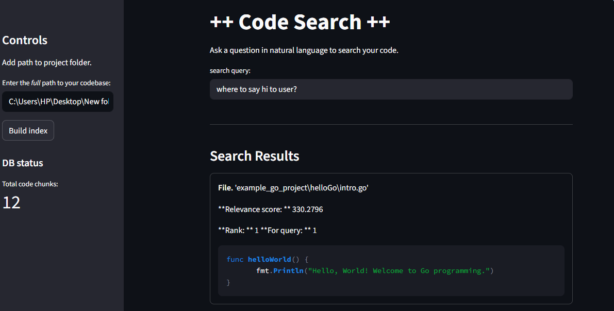

# Code_Search

### A Semantic Search Engine for Your Codebase

> Find the right code, not just the right keywords.

**Code_Search** lets you search your entire codebase using natural language.
Ask “how is user authentication handled?” — and instantly find the most relevant code snippets.

Built with **Streamlit**, **ChromaDB**, and the **nomic-ai/nomic-embed-text-v1.5** model, this tool understands the _meaning_ of your code, not just the _words_ inside it.

---

## Overview

Unlike a simple `Ctrl + F`, Code_Search performs **semantic search** — it identifies meaning and context in code instead of matching text literally.

It operates in two main phases:

### 1. Indexing

1. Walks through all directories to find supported files (Python, Go, Java, etc.)
2. Splits files into logical chunks using language-aware parsing (e.g., splitting Go files by the `func` keyword)
3. Converts each chunk into a vector embedding using the Nomic model
4. Stores embeddings in a **ChromaDB** vector database

Each stored code chunk is prefixed with `search_document:` to maintain consistent structure.

---

### 2. Querying

1. Converts your natural language query (e.g., “how to log a user in”) into an embedding vector
2. Searches the ChromaDB for the closest matching code vectors
3. Displays the most relevant results with syntax highlighting and similarity ranking

Your queries are prefixed with `search_query:` to help the model understand the search intent.

---

## Project Structure

```
code_search/
├── .gitignore              # Files to ignore in Git
├── app.py                  # Streamlit web application
├── indexer.py              # Logic for walking, parsing, and indexing
├── parser.py               # Code chunking logic per language
├── pics/                   # Screenshots and diagrams
├── poetry.lock             # Dependency lock file
├── pyproject.toml          # Poetry configuration and dependencies
├── readme.md               # This file
├── test.py                 # End-to-end testing script
└── utils.py                # Helper utilities (syntax highlighting, etc.)
```

---

## Key Technologies

| Purpose               | Technology                                            |
| --------------------- | ----------------------------------------------------- |
| User Interface        | Streamlit                                             |
| Vector Database       | ChromaDB                                              |
| Embedding Model       | nomic-ai/nomic-embed-text-v1.5                        |
| Dependency Management | Poetry                                                |
| Code Parsing          | Regex (language-aware, moving towards AST/TreeSitter) |
| File Handling         | Python built-ins (`os`, `re`)                         |

All dependencies are managed under `[tool.poetry.dependencies]` in `pyproject.toml`.

---

## Installation

### 1. Install Poetry

**macOS / Linux / WSL**

```bash
curl -sSL https://install.python-poetry.org | python3 -
```

**Windows (PowerShell)**

```powershell
(Invoke-WebRequest -Uri https://install.python-poetry.org -UseBasicParsing).Content | py -
```

---

### 2. Clone the Repository

```bash
git clone https://github.com/your-username/code_search.git
cd code_search
```

---

### 3. Install Dependencies

```bash
poetry install
```

**Activate the virtual environment:**

more info on your current env
```bash
poetry env info
poetry env list
poetry env use <env name>
```

**Activating the env:**
```bash
Invoke-Expression (poetry env activate)
```

---

## Usage

### Running the Streamlit App

Make sure you have activated the Poetry shell first:

```bash
streamlit run app.py
```

The application will automatically open in your default web browser.

---

### Step 1: Build the Index

1. In the sidebar, locate the text box labeled **“Enter the full path to your codebase:”**
2. Enter the absolute path to your project folder, for example:

   ```
   C:\Users\YourName\projects\my_app
   /home/yourname/projects/my_app
   ```

3. Click **Build Index**
4. Wait for the indexing process to complete. Larger projects may take a few minutes.
5. A message will appear: **“Indexing complete!”**

---

### Step 2: Search Your Code

Enter natural language queries into the search bar, such as:

- “function for user login and authentication”
- “how to connect to the postgres database”
- “class that handles Stripe payments”
- “http request handling in Go”

The app will return the top 3 most relevant code snippets with syntax highlighting.

---

## Example Interface



---

## Future Enhancements

Planned improvements include:

- **Persistent Vector Storage:** Retain existing embeddings between sessions
- **Project Folder Management:** Select and switch between multiple indexed projects
- **Batch Querying:** Support for simultaneous multi-query searches in ChromaDB
- **Smarter Chunking:** Use ASTs and TreeSitter for accurate, language-aware parsing
- **Integrated Code Explanation:** Connect to local or remote LLMs to explain results
- **Language Expansion:** Add specialized embedding models for more programming languages
- **Desktop and VS Code Integration:** Native or plugin-based use
- **Dependency Graph Visualization:** Render import/call graphs with `networkx` and `streamlit-agraph`
- **Automated GitHub Indexing:** Use webhooks to re-index changed files on `git push`
- **Production-Grade Enhancements:** Improve reliability, performance, and maintainability

> Built for developers who want to understand and navigate large codebases — fast.

